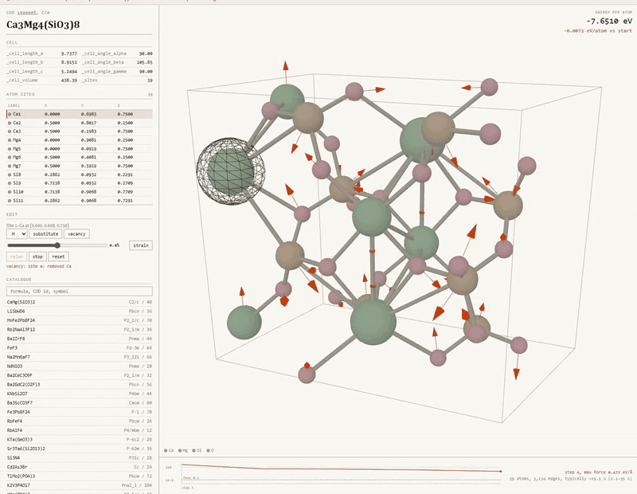

# anneal

Edit a real crystal structure and watch a machine-learned potential relax it, one step at a time.

[](https://github.com/markolivaic/anneal/actions/workflows/ci.yml)

anneal runs **CHGNet**, a pretrained universal interatomic potential, on crystal
structures from the **Crystallography Open Database**. Load a structure,
substitute an atom, pull out a vacancy or strain the cell, and press relax. Every
optimizer step streams to the browser as it is computed: the force trace
descends, the energy moves, the atoms shift. The relaxation is the animation, not
a wait before one. It is real, it uses 412,525 pretrained parameters, and it runs
on your CPU with no GPU.

## What this is NOT

CHGNet is an **approximation to DFT. It is not DFT.** The energies here are for
comparing your edit against the structure you started from. They are **not
publication-grade**, not benchmark labels, and not interchangeable with DFT
numbers. Nothing here was trained: the weights are the published ones, used as
published.

anneal does not offer all of COD. In a uniform random sample of 4,000 entries,
**27.8%** passed the filter (95% CI 26.5-29.2), which projects to roughly 147,000
of the **528,181** entries COD's default search returns. Two things do nearly all
of the cutting, and only one of them is about the model:

- **Cell size.** 62.6% of parsed entries hold more than 150 atoms. That is this
  project's CPU budget, not a limit of CHGNet.
- **Disorder.** 30.9% carry partial or mixed site occupancy. CHGNet has no
  defined behaviour on those and returns a confident number anyway, so anneal
  refuses them. That one is the model.

Hydrogen that the diffraction never located removes 1.8% more. Nothing in this
sample was rejected for element coverage, though the catalogue build rejected 6
of 12,000 on CHGNet's Z ≤ 94 bound. The limit is real, it is just rare.

## Walkthrough

[](docs/walkthrough/app-walkthrough.mp4)

[Full-resolution H.264 recording](docs/walkthrough/app-walkthrough.mp4), and the
[poster frame](docs/walkthrough/app-walkthrough-poster.jpg).

One uninterrupted recording of the running application. It loads diopside from
the catalogue, removes one calcium site, and relaxes the result. The vermilion
arrows are the forces CHGNet is predicting, and they shrink as the trace at the
bottom descends. That run converged in 30 steps at a maximum force of
0.071 eV/A. Every state transition is rendered by the running application. No
screen is mocked.

## Why this exists

A universal interatomic potential is 412,525 parameters and runs a relaxation on a
laptop CPU. I wanted to see whether that is enough to make crystal structures
something you poke at rather than read about.

Getting the model running took an afternoon. Then I pointed it at real COD
entries and most of them were not structures a potential can read: partial
occupancies, disordered sites, hydrogen the X-rays never located. CHGNet does not
error on any of that. It takes the input and returns a confident number that
means nothing, which is worse than failing. So the first thing built here was not
the viewer, it was `scripts/survey_cod.py`, which measures how much of COD
survives a filter. The answer decides what the project may honestly claim, and it is above,
not buried at the bottom.

Two findings changed the design, and both are in the tests so they cannot quietly
stop being true:

**A symmetric edit of a symmetric crystal produces no forces at all.** Remove a
sodium from rocksalt NaCl and the maximum force is 1.8×10⁻⁶ eV/Å. I spent an
hour treating that as a bug, because taking an atom out of a lattice obviously
has to pull on its neighbours. It does not. Every site sits
at an inversion centre; removing one leaves the survivors at inversion centres
too, where forces vanish exactly. The structure is already at a stationary point.
With positions alone there is nothing to relax and nothing to show, and the
textbook structures a teaching tool wants to demonstrate are exactly the
symmetric ones. So cell relaxation is on by default, which gives 13 steps and
−0.070 eV for that same edit. Strain is the exception: relaxing the cell after
someone strains it just undoes their edit, so `Mutation.suggested_relax_cell`
carries the right choice per edit.

**Cost is governed by graph edges, not atom count.** A 66-atom molecular crystal
and an 88-atom oxide have 5,418 and 5,424 edges and cost 524 and 466 ms per step:
a third apart in atoms, nearly identical in time. CHGNet's message passing runs
per edge. Fitting cost on edges instead of atoms moved R² from 0.85 to **0.984**,
and that fit is what the interface uses to tell you how long a relaxation will
take before you start it.

## How it works

```
COD REST  ──▶  filter  ──▶  catalogue  ──▶  viewer  ──▶  edit  ──▶  relax (SSE)
              (7 stages)     8,321          three.js    geometry    one event
                             structures                  only        per step
```

| File | Responsibility |
|---|---|
| `backend/anneal/cod.py` | COD REST, the on-disk CIF cache, the sampling frame |
| `backend/anneal/filters.py` | the seven-stage filter; `evaluate()` is the predicate |
| `backend/anneal/mutations.py` | substitute / vacancy / strain; pure geometry, no model |
| `backend/anneal/relax.py` | CHGNet single-point and relaxation with per-step callbacks |
| `backend/anneal/api.py` | HTTP surface; `POST /api/relax` streams one SSE event per step |
| `web/src/viewer.js` | unit cell, atoms, bonds, force vectors in three.js |
| `web/src/trace.js` | the force-convergence trace |
| `web/src/elements.js` | the palette rule, with a runtime assertion enforcing it |
| `scripts/survey_cod.py` | the survival rate and its funnel |
| `scripts/build_catalog.py` | the browsable catalogue |
| `scripts/benchmark.py` | every timing number below |
| `scripts/validate_against_experiment.py` | how far a relaxed cell lands from the measured one |

The relaxation loop is written directly on ASE rather than using CHGNet's
`StructOptimizer`, which builds its optimizer internally and exposes no per-step
hook. Without that hook there is no live trace, and the live trace is the point.

**One structural idea in the interface:** the page is a single entry from a
reference volume: a ruled two-column spread where the left column is the
structure as *record* (cell constants and a site table in the CIF's own tag/value
texture) and the right column is the same structure as *geometry*. You edit in
the record column; the geometry column answers.

**One colour rule, which is also the honesty mechanism:** *hue distinguishes
species, saturation marks provenance.* Elements are given hue at a single fixed
low chroma, so they read as tinted greys. Vermilion is the only saturated thing
on the page and belongs strictly to what CHGNet produced: relaxed positions,
force vectors, the energy delta, the trace, the edited site. **If it is
saturated, a model made it up.** `assertPaletteDiscipline()` fails loudly if an
element's chroma is ever raised toward the accent.

Type is Libertinus Serif, which descends from Linux Libertine, was built for
scientific typesetting, and renders the combining overbar in Hermann-Mauguin
symbols that most interface faces break.

The browser side is plain TypeScript on Vite with three.js and nothing else. One
route, one canvas, and an animation loop that owns the frame. A reconciler would
sit between this code and the renderer without earning its place.

## Quick start

Two processes: the Python API and the web dev server.

```bash
git clone https://github.com/markolivaic/anneal && cd anneal
python -m venv .venv && . .venv/bin/activate   # Windows: .venv\Scripts\activate
pip install -e "backend[model,dev]"
```

```bash
python -m uvicorn anneal.api:app --port 8000
```

```bash
cd web && npm ci && npm run dev
```

Open <http://localhost:5173>. The catalogue ships in `data/catalog.csv`, so there
is nothing to download first and no API key anywhere in this project.

To regenerate the data instead of trusting the committed copies:

```bash
python scripts/survey_cod.py --sample-size 4000 --seed 20260806
python scripts/build_catalog.py --max-fetch 12000
python scripts/benchmark.py
python scripts/validate_against_experiment.py --sample-size 200 --seed 20260814
```

The last one relaxes 200 structures and takes a couple of hours. It writes each
row as it goes and takes `--resume`, so an interrupted run continues instead of
starting over.

`pip install -e "backend[dev]"` without `model` skips CHGNet and its ~250 MB of
torch. The survey, the filter and every test in `tests/integrity` run fine
without it; relaxation does not.

## CLI

```bash
python scripts/fetch_cod.py 1000041 9016675 4124645
```
```
1000041  OK       Na4 Cl4  [8 sites, 2 primitive, 177.5 A^3]
9016675  OK       Fe12 C4  [16 sites, 16 primitive, 155.2 A^3]
4124645  REFUSED  size_within_limit: 288 sites > 150

2/3 accepted at max_atoms=150
```

A refusal names the stage that produced it. `scripts/fetch_cod.py` also abandons
any CIF over 4 MB before downloading it in full and reports that separately.
COD stores structure-factor blocks inside some files, and the largest in a
4,000-entry sample was 48.6 MB against a median of 19.6 KB.

## Verification

Measured on an AMD Ryzen, 16 threads, CPU only, 2026-08-07. Rerun anything here.

| Check | Command | Result |
|---|---|---|
| Behavioural tests: 73 | `pytest tests/unit` | 73 passed |
| Palette tests (JS): 12 | `cd web && npm test` | 12 passed |
| Integrity tests: 37 | `pytest tests/integrity` | 37 passed |
| Lint | `ruff check backend scripts tests` | clean |
| Format | `ruff format --check backend scripts tests` | clean |
| COD survival rate | `python scripts/survey_cod.py` | 27.82%, 95% CI 26.46-29.23 |
| Catalogue size | `python scripts/build_catalog.py` | 8,321 kept of 12,000 fetched |
| Model parameters | `python scripts/benchmark.py` | 412,525 (412,431 trainable) |
| Cost model fit | `python scripts/benchmark.py` | R² 0.984 on graph edges |
| Distance from experiment | `python scripts/validate_against_experiment.py` | +0.37% median cell volume error, n=196 |

Counts are split on purpose. The 37 integrity tests are greps. They assert that
the disclaimer still exists, that the percentage above matches
`data/survey_cod_summary.json`, that no local path leaked into the docs. They
prove nothing about correctness and are never added to the behavioural total.

### How wrong is it

"Approximation to DFT" is a caveat, not a measurement.
`scripts/validate_against_experiment.py` relaxes 200 catalogued structures with
the cell free and compares the result against the cell the crystallographer
measured. 196 converged, 4 hit the step ceiling and are reported separately.

The relaxed cell lands **+0.37%** from the deposited one, 95% CI +0.33 to +0.44,
median absolute error 0.39%. It over-expands almost every time: 183 of 196 cells
came out larger than measured, 9 smaller.

Splitting by the temperature the diffraction was run at was supposed to separate
thermal expansion from the model's own bias. It found no temperature effect at
all, and something else instead:

| measurement temperature | n | median volume error | contains carbon | median sites |
|---|---:|---:|---:|---:|
| under 150 K | 37 | +0.32% | 31 | 74 |
| 150 to 250 K | 36 | +0.32% | 34 | 72 |
| over 250 K | 65 | +0.33% | 49 | 67 |
| not recorded | 58 | **+2.24%** | 5 | 28 |

Across a 193 K span of median temperature the error moves by 0.01 percentage
points. The bin that stands out is the one with no temperature at all, seven
times worse and fifteen times more scattered, and the last two columns say why:
the recorded bins are 75 to 94% carbon-containing molecular crystals of around
70 sites, the unrecorded bin is 9% carbon and half the size. Modern
single-crystal refinements log a temperature and older inorganic entries do not,
so the split sorts by chemistry and era rather than by temperature.

That is why those two columns are in the artifact. A temperature bin is a
population, not a controlled variable, and the confound is cheaper to expose
than to argue about. **This does not show that inorganic structures are harder
for CHGNet.** The bins differ in three ways at once, and testing that claim
needs a comparison built for it.

Two things this is not. The reference is a diffraction measurement, so the
figure is CHGNet's distance from **experiment**, which is not its error against
the DFT-PBE data it was trained on. And it measures geometry only: the energies
anneal displays have no experimental counterpart here, so a cell landing within
half a percent says nothing about whether an energy difference is right.
`data/validation_summary.json` records nine limitations alongside the numbers.

Timings from `data/benchmark.json`:

| atoms | graph edges | single point | steps | ms/step | full relax |
|---:|---:|---:|---:|---:|---:|
| 2 | 128 | 59 ms | 10 | 72 | 0.7 s |
| 36 | 2,280 | 190 ms | 48 | 253 | 12.1 s |
| 66 | 5,418 | 470 ms | 74 | 524 | 38.8 s |
| 88 | 5,424 | 414 ms | 43 | 466 | 20.0 s |
| 106 | 8,048 | 658 ms | 88 | 693 | 61.0 s |
| 124 | 10,104 | 797 ms | 56 | 810 | 45.4 s |
| 150 | 14,244 | 1,094 ms | 51 | 1,318 | 67.2 s |

## Limitations and failure modes

- **The measured +0.37% is geometry, and only against experiment.** It says
  where a relaxed cell lands relative to a diffraction measurement. It is not
  CHGNet's error against the DFT data it was trained on, and it is not evidence
  about the energies this tool displays, which have no experimental counterpart
  to be checked against. A cell within half a percent can still sit on a wrong
  energy difference.
- **The energies are not DFT.** CHGNet is trained on DFT and approximates it.
  Treat a difference between two of your own structures as meaningful and an
  absolute value as not.
- **Relaxations at the top of the range take about a minute.** A 150-atom cell is
  67 s over 51 steps here. It streams, so you watch it rather than wait for it,
  and the stop button always works and keeps every step already computed, but it
  is a minute.
- **Missing hydrogen is only caught when the CIF admits it.** The filter compares
  the declared formula against the atom sites. An entry that omits hydrogen from
  *both* is invisible to it. Among the 1,113 survivors in the sampled set, 10
  contain carbon and no hydrogen at all, and every one of those ten is genuinely
  hydrogen-free (WC, Fe₃C, CeB₂C, fluorinated graphite, carbonates, cyanides),
  but the rule cannot prove that in general. A ratio-based version
  that tried to catch partial hydrogen loss was tested and dropped: on 548 entries
  it caught zero cases the simple rule misses and produced false positives.
- **The catalogue is not a random sample and its size is not a survival rate.**
  `data/catalog.csv` comes from a volume-bounded COD query (under 1500 ų, 95%
  precision and 92.3% recall for cells of 150 atoms or fewer), because a uniform
  sample spends most of its requests on cells too large to offer. The 27.8% above
  is the uniform-sample number and the only one that describes COD.
- **Symmetry labels may disagree with the depositor.** They are recomputed from
  coordinates at 0.1 Å tolerance.
- **The size filter uses the deposited cell, not the primitive cell.** Filtering
  on primitive cells would admit more structures, but the viewer shows the
  deposited cell and an edit has to map to what is on screen.
- **The frame is 528,181 of COD's stated 534,673.** The difference is 5,416
  duplicates, 9 error-flagged and 1,004 theoretical entries that COD's default
  search excludes; 46 are returned by no query I tried.
- **Timings are from one machine.** Rerun `scripts/benchmark.py` and the table
  and the in-app estimate both become yours.

## References

- Deng et al., *CHGNet: Pretrained universal neural network potential for
  charge-informed atomistic modelling*, Nature Machine Intelligence, 2023.
- Gražulis et al., *Crystallography Open Database: an open-access collection of
  crystal structures*, J. Appl. Cryst., 2009.
- Bitzek et al., *Structural relaxation made simple* (FIRE), Phys. Rev. Lett., 2006.

These references motivate the design; they do not validate the numbers here.
Those come from the scripts in `scripts/`.

## License

MIT. See [LICENSE](LICENSE). Third-party data and model attribution is in
[THIRD_PARTY_NOTICES.md](THIRD_PARTY_NOTICES.md). COD content is public domain;
CHGNet is Modified BSD.
